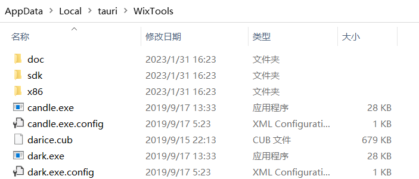

<div align="center">
  <h1>V3 Tauri Vite</h1>
</div>

## ⚡ 简介

用前端技术构建一个更小、更快、更安全的桌面应用程序，基于 Tauri、Vue3、TypeScript、Element Plus、Pinia 和 Vite 等主流技术.

- main 分支：源码来自[v3-admin-vite](https://github.com/un-pany/v3-admin-vite)
- mini 分支：精简版，仅有登录页和主页

## ⏳ 准备

- 安装 `Rust` 与系统依赖，详细步骤请参考[官网](https://tauri.app/zh-cn/v1/guides/getting-started/prerequisites)

- win10 及以下需要注意，`Tauri` 需要 WebView2 才可以运行，若是缺少 WebView2 ，可通过 `libs/MicrosoftEdgeWebview2Setup.exe` 进行安装

## 🚀 开发

```bash

# 配置
1. 一键安装 .vscode 目录中推荐的插件
2. node 版本 16+
3. pnpm 版本 7.x

# 进入项目目录
cd v3-tauri-vite

# 安装依赖
pnpm i

# 初始化 husky
pnpm prepare

# 启动服务
pnpm dev

# 升级所有依赖
pnpm up --latest
```

## 🔧 代码格式检查

```bash
pnpm lint
```

## 📦️ 多环境打包

- 若是无法下载 `wix311-binaries.zip`，则将 `libs/WixTools.zip` 解压后放在 `%USERPROFILE%\AppData\Local\tauri` 目录下，如下图所示
  

```bash
# 根据当前系统环境构建
pnpm build

# 构建 x64 位
pnpm build:x64

# 构建 x32 位
pnpm build:x32
```

## ✨ Git 提交规范参考

- `feat` 增加新的业务功能
- `fix` 修复业务问题/BUG
- `perf` 优化性能
- `style` 更改代码风格, 不影响运行结果
- `refactor` 重构代码
- `revert` 撤销更改
- `test` 测试相关, 不涉及业务代码的更改
- `docs` 文档和注释相关
- `chore` 更新依赖/修改脚手架配置等琐事
- `workflow` 工作流改进
- `ci` 持续集成相关
- `types` 类型定义文件更改
- `wip` 开发中

## 📄 参考资料

- [Tauri 官网](https://tauri.app/)
- [Tauri 应用](https://juejin.cn/post/7116185354293477383)
